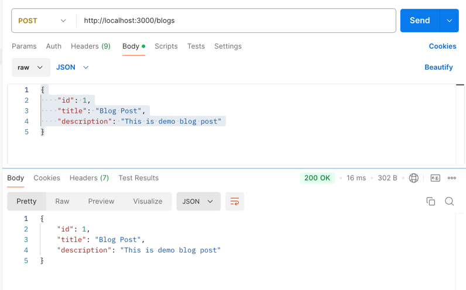

# JSON Middleware

In the previous lessons, we learned about middleware in Express. Middleware functions are functions that have access to the request object (`req`), the response object (`res`), and the next middleware function in the application’s request-response cycle. 
Express provides few built-in middleware functions which can be used to perform various tasks. One of the most commonly used middleware is `express.json()` which is used to parse incoming request with JSON payloads. This tutorial demonstrates how to use `express.json()` one of the built-in middlewares in your express code.

The `express.json()` middleware helps parse incoming JSON data and makes the data available directly under `req.body` for easier access. This can be useful when you're building web API that accepts JSON data in the request body. You might accept JSON data when creating new rsources, updating existing resources or deleting resources.

## Example Usage

Create a new express application with the following code.

```javascript
const express = require('express');
const app = express();

const hostname = 'localhost';
const port = 3000;

app.use(express.json());

app.post('/blogs', (req, res) => {
    console.log(req.body);
    res.json(req.body);
});

app.listen(3000, () => {
    console.log(`Server running at http://${hostname}:${port}/`);
});
```

In this code, I have defined only one endpoint `/blogs` which handles the POST reqeusts. In order to create new blog post, you can send a POST request to `/blogs` with the JSON data in the request body. The `express.json()` middleware parses the incoming JSON data and makes it available under `req.body`. In the route handler, I am simply logging the `req.body` to the console and sending it back as a response. Now, in order to make POST request, you need tools like Postman or Insomnia to send POST requests to the server.

Make request to `/blogs` endpoint with the following JSON data as request body.

```json
{
    "id": 1,
    "title": "Blog Post",
    "description": "This is demo blog post"
}
```

In response, you will get the same response back  as you can see in below screenshot from Postman. You will also see the same logged in the console where you're running your server. As you can see that `req.body` is populated with the JSON data. You can access each of these fields using dot notation like `req.body.id`, `req.body.title`, `req.body.description`.



### JSON Middleware Options

This `express.json()` middleware also provides several options to configure the behavior of the middleware. You can pass an object with options to the `express.json()` method. Here are some of the options that you can pass to the `express.json()` method.

- `inflate`: This option enables or disables handling deflated (compressed) bodies. Default is `true`.
- `limit`: This option controls the maximum request body size. Default is `100kb`.
- `type`: This option controls which content types are handled by the middleware. Default is `application/json`.
- `verify`: This option is a function to verify the body content. Default is `undefined`.
