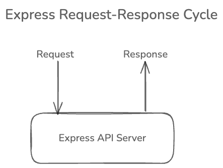
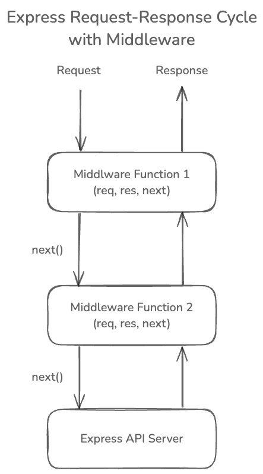

# Express Middleware

Express provides a way to add middleware functions to the request-response cycle. Middleware functions are functions that have access to the request object (`req`), the response object (`res`), and the next middleware function in the application’s request-response cycle. The next middleware function is commonly denoted by a variable named `next`.

Let's first see where it fits in the request-response cycle. The following diagram shows the request-response cycle in Express.



In Express server, you would get a request from the client and you send back a response. This is complete request-response cycle so far. However, sometimes, you might want additional processing to be done before sending the request or response. For example, you may want to log the request details, verify that the user is authenticated. This is where middlware can help you as they wrap common functionality that you want to apply to all requests.

Below is the diagram which shows where middleware fits in the request-response cycle.



When a request is sent, it first goes through the middleware function before reaching the route handler. The middleware function takes three arguments: the request object, the response object and next middleware function. Again, when returning response, the response goes through the middleware function before being sent back to the client. The third argument next function, usually denoted by `next` is a callback function which is called to pass the control to the next middleware function in the request-response cycle. At the end of the middleware function, you must call the `next()` function to pass the control to the next middleware function. If you don't call the `next()` function, the request will be stuck and the response will not be sent back to the client.

To use any middleware function, you can use the `app.use()` method. This method takes a middleware function as an argument. Here is an example of a simple middleware function that logs the request details.

```javascript
app.use(function (req, res, next) {
    console.log(`${Date.now()}: ${req.method}: ${req.url}`);
    next();
});
```

Here, I have passed an anonymous function which logs the epoch time, request method and request URL. The `next()` function is called at the end of the function to pass the control to the next middleware function or route handler.

It's also important to put this middleware function before the route handlers. This is because the middleware functions are executed in the order they are defined. If you put the middleware function after the route handler, the request will not go through the middleware function.

The complete code looks like below.

```javascript
const express = require('express');

const hostname = 'localhost';
const port = 3000;

const app = express();

const blogs = [
    {
        id: 1,
        title: 'Blog Post 1',
        content: 'Content of Blog 1'
    },
    {
        id: 2,
        title: 'Blog Post 2',
        content: 'Content of Blog 2'
    },
    {
        id: 3,
        title: 'Blog Post 3',
        content: 'Content of Blog 3'
    }
];

app.use(function (req, res, next) {
    console.log(`${Date.now()}: ${req.method}: ${req.url}`);
    next();
});

app.get('/', (req, res) => {
    res.json({ message: 'Welcome to our blog' });
});

app.get('/blogs', (req, res) => {
    const sortType = req.query.sort || 'desc';
    if (sortType === 'asc') {
        blogs.sort((a, b) => a.id - b.id);
    }
    res.json(blogs);
});

app.get('/blogs/:id', (req, res) => {
    const id = Number(req.params.id);
    const blog = blogs.find(blog => blog.id === id);
    res.json(blog);
});

app.listen(3000, () => {
    console.log(`Server running at http://${hostname}:${port}/`);
});
```

Now, try requesting any endpoint and you will see the request details in the console like this.

```plaintext
1730618299106: GET: /blogs/1
```

If you have yet another middleware which logs the response details, you can see the response details as well. Below is I have added one more middleware which should come before the previous middleware to log time it takes to send the response. In this code, I have used `res.on('finish')` event to log the time it takes to send the response. Notice that I can also intercept the response object and logging the status code of the response.

```javascript
app.use(function (req, res, next) {
    res.on('finish', () => {
        console.log(`${Date.now()}: ${req.method}: ${req.url}: ${res.statusCode}`);
    });
    next();
});

app.use(function (req, res, next) {
    console.log(`${Date.now()}: ${req.method}: ${req.url}`);
    next();
});
// other code
```

Now, when you send a request, you will see two log lines in the console.

```plaintext
1730618932523: GET: /blogs/1
GET: /blogs/1: 200 - 1ms
```

There are also quite a lot of middleware functions available in Express which you can use to add additional functionality to your application. Some of them you will use in this tutorial series. For example, `express.json()` middleware is used to parse the incoming request with JSON payloads. Similarly, `express.static()` middleware is used to serve static files like images, CSS, JavaScript files, etc.