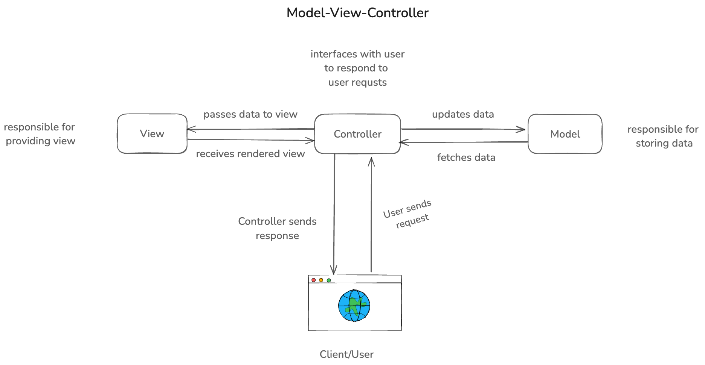

# MVC Architecture

Model View Controller (MVC) is a software design pattern used for developing user facing applications. It divides the application into three interconnected components. Each of these components has its own responsibility and together they make the application more organized and easier to maintain. This approach was traditionally used for desktop applications but has become popular for web applications as well. The main purpose of this pattern was to solve the problem of separating the concerns of the application to make them more manageable.

## Components of MVC

### Controller

The controller is what enables the user to interact with the application. It receives the input from the user and sends the data to the model for processing. The controller is responsible for handling the user input and updating the view. It acts as an intermediary between the model and the view. When a user makes a request to the web application, they send some information as path parameters or query parameters. The controller receives the request and applies business logic to verify the user is authorized to access the data. Behind the scenes, it interacts with model to fetch the required data to serve users' requests. Once data is received, it sends this data to the view to form and HTML response to send back to the client.

### Model

The model is responsible for managing the data of the application. It interacts with the database or any other datastore in the backend to fetch the data and sends it to the controller. The model is the representation of the data that the application operates on. It is responsible for managing the data and the business logic of the application. The model is responsible for fetching data from the database, updating the data and deleting the data. It also ensures data integrity and consistency while interacting with datastores. 

### View

The view is used for handling the UI representation of the data. When a user visits a web page, they should be given personalized view which is customized to their own preferences. Each user may have their own name displayed in their dashboard and they may be able to see their own email address in the profile. All these are similar for each user except that the data is different for each user. This is handled by the view part which is responsible for rendering the data to the user. The view is responsible for displaying the data to the user in a way that is easy to understand. The controller passes the data to the view which is then rendered to the user. 

## What are benefits of MVC architecture?

This section points out some of the benefits and drawbacks of MVC architecture.
### Advantages of MVC

- It improves code organization into three distinct layers. This is very useful for large applications to maintain the codebase.
- With this pattern, developers can work independently on different components of the application. For example, UI developer can work on the view part while the backend developers can work on the model and controller part at the same time. This enables faster development and better collaboration among team members.
- Because of separation of concerns, this pattern promotes modularity. This way it is easier to scale the application when needed. You can easily add new features or modify existing features without affecting other parts of the application.
- Each components of the MVC architecture can be tested independently. You can write unit tests for each component to ensure its working as expected.

### Drawbacks of MVC

- It can be difficult to read for new developers as each part of the application is in separate modules.
- It may sometimes be an overkill for very small applications.
- If a single developer is working on all three parts of the application, he/she might have to adjust to the different paradigms of each component.
- It can sometimes be difficult to debug because the application flow moves from one component to another.