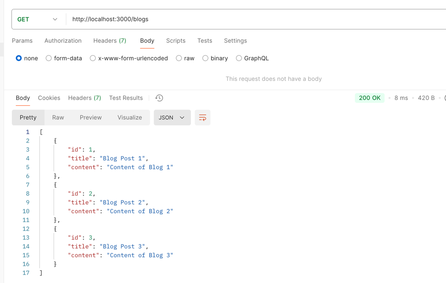
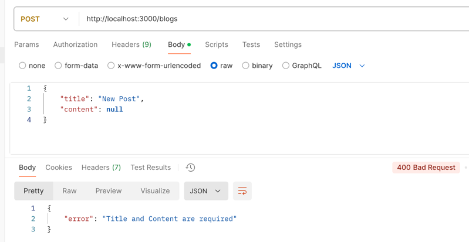

# Handling POST Requests

When working with APIs, the data is usually sent in request body as a JSON object. In order to parse this JSON data, we need a way to understand JSON data in our Express application. Fortunately, Express.js comes with a middleware which we can add simply by calling `express.json()`. It parses incoming requests with JSON payloads and makes the data available under `req.body` property. 

So, we add new line with `app.use(express.json())` before defining any routes.

Next, we need a route handler to handle `POST` request to our `/blogs` endpoint so that we can add new blog posts. We can use `app.post()` method to define a route handler for `POST` requests.

```javascript
app.post('/blogs', (req, res) => {
    const newBlog = {
        id: blogs.length + 1,
        title: req.body.title,
        content: req.body.content
    };
    blogs.push(newBlog);
    res.json(newBlog);
});
```

In this handler function, I can simply parse the incoming JSON data from the request body and create a new blog object. Notice that the client doesn't need to send the `id` of the blog. That's something I am generating based on my existing `blogs` collection. I then push this new blog object to the `blogs` array and send the new blog object as a response.

## Beware of User Data

Now, you might feel like it was so easy. However, whenever you're dealing with user data, you need to be extra careful. The client may not send the correct data as expected. So, it's always a good idea to validate that the client has sent required data and it's not `undefined` or `null`. You can use a simple `if` statement to check if the required data is present in the request body. If the those two fields `title` and `content` is not sent in the request body, you can send a `400 Bad Request` response with an error message. If the data is validated, you can proceed and create a new blog post.

```javascript
app.post('/blogs', (req, res) => {
    if (!req.body.title || !req.body.content) {
        return res.status(400).json({ error: 'Title and Content are required' });
    }

    const newBlog = {
        id: blogs.length + 1,
        title: req.body.title,
        content: req.body.content
    };
    blogs.push(newBlog);
    res.json(newBlog);
});
```

The complete code for this application looks like below in `index.js` file.

```javascript
const express = require('express');

const hostname = 'localhost';
const port = 3000;

const app = express();

const blogs = [
    {
        id: 1,
        title: 'Blog Post 1',
        content: 'Content of Blog 1'
    },
    {
        id: 2,
        title: 'Blog Post 2',
        content: 'Content of Blog 2'
    },
    {
        id: 3,
        title: 'Blog Post 3',
        content: 'Content of Blog 3'
    }
];

app.use(express.json());

app.post('/blogs', (req, res) => {
    if (!req.body.title || !req.body.content) {
        return res.status(400).json({ error: 'Title and Content are required' });
    }

    const newBlog = {
        id: blogs.length + 1,
        title: req.body.title,
        content: req.body.content
    };
    blogs.push(newBlog);
    res.json(newBlog);
});

app.get('/', (req, res) => {
    res.json({ message: 'Welcome to our blog' });
});

app.get('/blogs', (req, res) => {
    const sortType = req.query.sort || 'desc';
    if (sortType === 'asc') {
        blogs.sort((a, b) => a.id - b.id);
    }
    res.json(blogs);
});


app.get('/blogs/:id', (req, res) => {
    const id = Number(req.params.id);
    const blog = blogs.find(blog => blog.id === id);
    res.json(blog);
});

app.listen(3000, () => {
    console.log(`Server running at http://${hostname}:${port}/`);
});
```

Now, run the server and use Postman to validate your data. When you make a HTTP `GET` request to `/blogs` endpoint, you will get three blog posts from the array.



After this, you can change this to `POST` request for the same endpoint and go to `raw` tab in Postman and select `JSON` from the dropdown. Add the following JSON data in the request body.

```json
{
    "title": "Blog Post 4",
    "content": null
}
```

You will see that the API returns a `400 Bad Request` response with an error message.



This is because the `content` field is `null` and we have added a check that both `title` and `content` both are required fields. Now, modify the `content` with some data and try again. This time you will get `200 OK` response with the new blog post. You can also see that the new blog post gets a new `id` based on the length of the `blogs` array.

Now, the convention is to send a `201 Created` status code when a new resource is created. In this case, you're creating a new blog post. So, you can change the status code to `201` and send the new blog post as a response.

```javascript
app.post('/blogs', (req, res) => {
    if (!req.body.title || !req.body.content) {
        return res.status(400).json({ error: 'Title and Content are required' });
    }

    const newBlog = {
        id: blogs.length + 1,
        title: req.body.title,
        content: req.body.content
    };
    blogs.push(newBlog);
    res.status(201).json(newBlog);
});
```

Now, you will get `201 Created` status code when a new blog post is created.