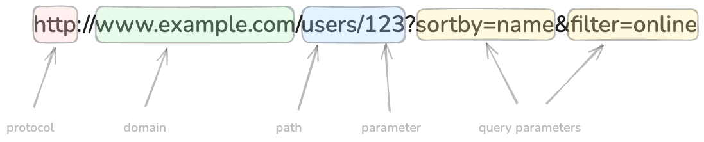

# Handling Route Parameters

The web URL consists of several parts as shown in the image below.



The first part is the protocol which can be `http` or `https`. The second part is the domain name which is the address of the server where the website is hosted. After the domain, sometimes, there can be specific port number or it can automatically inferred as port `80` for http and `443` for https. The third part is resource path. This can include variable parts which are called route parameters. Finally, there can be query parameters which can be optinally used to filter or sort the data. Multiple query parameters can be passed by separating them with `&` symbol.

Let's try building simple application which uses route parameters. In this case, I will build a very simple blog application which has a list of blog posts. Each blog is identified by their unique id. The URL for each blog post will be `/blog/:id` where `:id` is the unique identifier for the blog post.

Create a new file called `index.js` and write the following code in it.

```javascript
const express = require('express');

const hostname = 'localhost';
const port = 3000;

const app = express();

const blogs = [
    {
        id: 1,
        title: 'Blog Post 1',
        content: 'Content of Blog 1'
    },
    {
        id: 2,
        title: 'Blog Post 2',
        content: 'Content of Blog 2'
    },
    {
        id: 3,
        title: 'Blog Post 3',
        content: 'Content of Blog 3'
    }
];

app.get('/', (req, res) => {
    res.json({ message: 'Welcome to our blog' });
});

app.get('/blogs', (req, res) => {
    res.json(blogs);
});

app.get('/blogs/:id', (req, res) => {
    const id = Number(req.params.id);
    const blog = blogs.find(blog => blog.id === id);
    res.json(blog);
});

app.listen(3000, () => {
    console.log(`Server running at http://${hostname}:${port}/`);
});
```

In this code, I have defined three routes. The first route is the root path `/` which sends a simple JSON response with a message "Welcome to our blog". The second route is `/blogs` which sends a JSON response with the list of all blog posts. The third route is `/blogs/:id` which sends a JSON response with the blog post that matches the id passed in the URL.

Notice that the route for individual posts is defined as `/blogs/:id`. The `:id` is a route parameter which can be variable value and can be accessed in the server code using the request object using `req.params.id`. In the route handler, I am finding the blog post with the given id and sending it as a JSON response. Also note that the request parameter is a string and I am converting it to a number using `Number()` function. This is important because the id in the blog object is a number and I want to compare them correctly.
