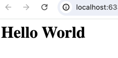

## What is HTML?

The world wide web is full of lots of information. Those information are written using different languages. One of the most popular language used to write information on the web is HTML. HTML stands for HyperText Markup Language. HTLM files are simple text files that are written with specific syntax to represent information to the web browsers. If you want to create one of the web pages yourself, all you need is a text editor and a web browser. 

You can use text editors like VS Code, Atom or Sublime text which offer syntax highlighting for HTML. Please note that Microsoft Word is not really a text editor because it applies formatting to the text which is not suitable for writing code. The most common text editor is Notepad in Windows and TextEdit in Mac. These text editors are simple and do not apply any specific styling to the files you create.

HTML is not a programming language. It is a markup language. It is used to structure content on the web. HTML is the standard markup language for documents designed to be displayed in a web browser. Web pages can be augmented by technologies such as Cascading Style Sheets (CSS) and scripting languages such as JavaScript.

### First HTML web page

Write this into your text editor and save it as `index.html`:

```html
Hello World
```

Save this file in your computer and open it with a web browser. You will see the text `Hello World` displayed on the web browser. This is the simplest HTML file you can create.


> **Note:** HTML files are saved with the `.html` extension. This is the standard file extension for HTML files. By default your text editor might be saving files as `.txt` files. Make sure to change the file extension to `.html` when saving HTML files.

In order to view it on web browser, you can right click on the file and select `Open with` and choose your web browser. You can also drag and drop the file into the web browser.

### First Exploration of Tags

Now, change your text file to the following:

```html
<h1>Hello World</h1>
```

Refresh the web browser and you will see the text `Hello World` displayed as a heading. 



The `<h1>` is called a tag in HTML (more on this later). It's used to define heading in HTML and browsers will display it as a larger font with bold text.
