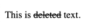

# Paragraphs in HTML

In HTML, paragraphs are defined using the `<p>` tag. The `<p>` tag is used to define a paragraph in HTML. Browsers will display the content inside the `<p>` tag as a paragraph.

Type following in your HTML file and open it in a browser to see the output:

```html
<!DOCTYPE html>
<html>
<body>
    This is a paragraph. 
    This is another paragraph.
</body>
</html>
```

In the browser you will see two lines joined together like this.


`This is a pragraph. This is another paragraph.`

If you really want two paragraphs in the output, you need to use the `<p>` tag like this:

```html
<body>
    <p>This is a paragraph.</p>
    <p>This is another paragraph.</p>
</body>
```

You can see that it will display two paragraphs on the web page. You can see that both lines appear on their own separate lines.

## Line Breaks

While we are talking about paragraphs, we can talk about line breaks. In HTML, you can use the `<br>` tag to insert a line break. The `<br>` tag is an empty tag, which means it does not have a closing tag. It is used to insert a line break in the text. This can be used when you want to create a new line without creating a new paragraph.

Type following in the `body` of HTML file and open it in a browser to see the output:

```html
<body>
    This is a paragraph.<br>
    This is another paragraph.
</body>
```

> **Note:** The `<br>` tag is an empty tag.There is no content involved in breaking lines, so it does not have a closing tag.

It may be easy to overuse `<br>` tags. It is better to use CSS to control the layout of the page.

## Emphasizing Text

You can emphasize text in HTML using the `<em>` tag. The `<em>` tag is used to define emphasized text. Browsers will display the content inside the `<em>` tag as italicized text. Similarly, you could use the `<strong>` tag to define strong text. Browsers will display the content inside the `<strong>` tag as bold text. Again, note that even though browsers display them in certain manner doesn't mean you should use these tags to italicize or bold text. You should use CSS for that. However, browsers by default displays them in italic and bold respectively.

Type following in the `body` of HTML file and open it in a browser to see the output:

```html
<!DOCTYPE html>
<html>
<body>
    This is <em>emphasized</em> text.
    This is <strong>strong</strong> text.
</body>
</html>
```

You will see that the emphasized text is displayed in italic and the strong text is displayed in bold.


There are also tags `<i>` and `<b>` which are used to italicize and bold text respectively. However, these tags are not recommended to use because they are not semantic. They are used for styling text.

## Horizontal Rule

Another self closing tag is the `<hr>` tag. The `<hr>` tag is used to create a horizontal rule in the text. It is used to separate content in the text. It is a self closing tag, which means it does not have a closing tag.

Type following in the `body` of HTML file and open it in a browser to see the output:

```html
<!DOCTYPE html>
<html>
<body>
    This is a paragraph.
    <hr>
    This is another paragraph.
</body>
</html>
```

You will see a horizontal line separating the two paragraphs.

## Formatting Text

There are several tags for formatting text in different ways. 

### HTML `<sub>` and `<sup>` tag:

- `<sub>` tag is used to define subscript text. Browsers will display the content inside the `<sub>` tag as subscript text.
- `<sup>` tag is used to define superscript text. Browsers will display the content inside the `<sup>` tag as superscript text.

Type following in the `body` of HTML file and open it in a browser to see the output:

```html
<!DOCTYPE html>
<html>
<body>
    2 to the power of 4:  2<sup>4</sup>.<br>
    Log: log <sub>e</sub><sup>2</sup>.
</body>
</html>
```


### HTML `<del>` tag:

- `<del>` tag is used to define deleted text. Browsers will display the content inside the `<del>` tag as deleted text.

```html
<body>
    <p>This is <del>deleted</del> text.</p>
</body>
```



### HTML `<ins>` tag:

- `<ins>` tag is used to define inserted text. Browsers will display the content inside the `<ins>` tag as inserted text.

```html
<body>
    <p>This is <del>incorrect</del> <ins>corrected</ins> text.</p>
</body>
```

This will display text `incorrect` as deleted` and `corrected` as inserted.

### HTML `<mark>` tag:

- `<mark>` tag is used to highlight text. Browsers will display the content inside the `<mark>` tag as highlighted text.

```html
<body>
    <p>This is <mark>highlighted</mark> text.</p>
</body>
```

- `<small>` tag is used to define smaller text. Browsers will display the content inside the `<small>` tag as smaller text.
- `<cite>` tag is used to define the title of a work. Browsers will display the content inside the `<cite>` tag as the title of a work.

```html
<body>
    <p>This is <small>smaller</small> text.</p>
    <p>This is a <cite>title</cite> of a work.</p>
</body>
```

- `<q>` tag is used to define a short quotation. Browsers will display the content inside the `<q>` tag as a short quotation.

```html
<body>
    <p>This is a <q>short quotation</q>.</p>
</body>
```

- `<blockquote>` tag is used to define a block quotation. Browsers will display the content inside the `<blockquote>` tag as a block quotation.

```html
<body>
    <blockquote>
        This is a block quotation.
    </blockquote>
</body>
```

Here is a code for all the formatting tags:

```html
<!DOCTYPE html>
<html>
<body>
    2 to the power of 4:  2<sup>4</sup>.<br>
    Log: log <sub>e</sub><sup>2</sup>.<br>
    This is <del>deleted</del> text.<br>
    This is <del>incorrect</del> <ins>corrected</ins> text.<br>
    This is <mark>highlighted</mark> text.<br>
    This is <small>smaller</small> text.<br>
    This is a <cite>title</cite> of a work.<br>
    This is a <q>short quotation</q>.<br>
    <blockquote>
        This is a block quotation.
    </blockquote>
</body>
</html>
```


