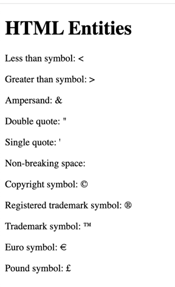

# HTML Entities

HTML entities are special characters that are reserved for use in an HTML document. These characters are not allowed to be used in HTML code. If you want to use these characters in your HTML document, you need to use the entity name or entity number. These are items like less than symbol or grater than symbol. These cannot be typed directly into the HTML document because it will confuse the browser as to whether it is an HTML tag or just a character. Instead, entity names can be used to reprsent these characters.

Here are some of the most common HTML entities:

| Entity Name | Entity Number | Description |
|-------------|---------------|-------------|
| `&lt;`      | `&#60;`       | Less than symbol |
| `&gt;`      | `&#62;`       | Greater than symbol |
| `&amp;`     | `&#38;`       | Ampersand |
| `&quot;`    | `&#34;`       | Double quote |
| `&apos;`    | `&#39;`       | Single quote |
| `&nbsp;`    | `&#160;`      | Non-breaking space |
| `&copy;`    | `&#169;`      | Copyright symbol |
| `&reg;`     | `&#174;`      | Registered trademark symbol |
| `&trade;`   | `&#8482;`     | Trademark symbol |
| `&euro;`    | `&#8364;`     | Euro symbol |
| `&pound;`   | `&#163;`      | Pound symbol |
| `&yen;`     | `&#165;`      | Yen symbol |
| `&cent;`    | `&#162;`      | Cent symbol |
| `&deg;`     | `&#176;`      | Degree symbol |

## HTML Entity Examples

```html
<!DOCTYPE html>
<html>
<head>
    <title>Less Than Symbol</title>
</head>
<body>
    <p>Less than symbol: &lt;</p>
    <p>Greater than symbol: &gt;</p>
    <p>Ampersand: &amp;</p>
    <p>Double quote: &quot;</p>
    <p>Single quote: &apos;</p>
    <p>Non-breaking space: &nbsp;</p>
    <p>Copyright symbol: &copy;</p>
    <p>Registered trademark symbol: &reg;</p>
    <p>Trademark symbol: &trade;</p>
    <p>Euro symbol: &euro;</p>
    <p>Pound symbol: &pound;</p>
</body>
</html>
```

This will produce output like this.

