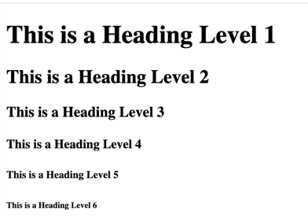

# HTML Headings

If you have ever read a book, you know that it has a title, chapters, sections, and subsections. Similarly, a web page has headings. Headings are used to define the structure of a web page. They are used to define the hierarchy of the content on the page.

HTML has six levels of headings. The `<h1>` tag is used for the main heading, `<h2>` tag is used for subheadings, `<h3>` tag is used for sub-subheadings, and so on. The `<h6>` tag is used for the least important headings.

Here is an example of how to use headings in HTML:

```html
<!DOCTYPE html>
<html>
<body>
    <h1>This is a Heading Level 1</h1>
    <h2>This is a Heading Level 2</h2>
    <h3>This is a Heading Level 3</h3>
    <h4>This is a Heading Level 4</h4>
    <h5>This is a Heading Level 5</h5>
    <h6>This is a Heading Level 6</h6>
</body>
</html>
```

The above code will display the following headings on the web page:



As you can see, the `<h1>` tag is the largest and most important heading, and the `<h6>` tag is the smallest and least important heading. This styling is applied by web browsers by default. However, the main purpose of headings is to define the structure of the content on the page, not to style the content. For example, `<h1>` should be the main content of the web page and it must be just one in the whole page. This can have sections so there can be multiple `<h2>`s to define section headings. Similarly, each section can have subsections whose headings can be defined using `<h3>` tags. You can use CSS to style the headings as per your requirements.

## HTML Comments

While we are at it, it's important to understand the purpose of comments in HTML. Comments are used to add notes to the code. They are not displayed on the web page. They are used to explain the code to other developers or to remind yourself about the code. Comments are also used to temporarily remove code from the page. This is useful when you want to test the page without a particular section of the code.

In HTML, comments are written using the `<!--` and `-->` tags. Anything written between these tags is considered a comment. Here is an example of how to write comments in HTML:

```html
<!DOCTYPE html>
<html>
<body>
    <!-- This is a comment -->
    <h1>This is a Heading Level 1</h1>
    <h2>This is a Heading Level 2</h2>
    <!-- <h3>This is a Heading Level 3</h3> -->
    <h4>This is a Heading Level 4</h4>
    <h5>This is a Heading Level 5</h5>
    <h6>This is a Heading Level 6</h6>
</body>
</html>
```

This will display exactly the same as previously. The comments should be used only when necessary and they should be meaningful. 

Most modern code editors have shortcuts to comment out code. For example, in VS code, you can simply put your cursor on the line you want to comment out and press `Ctrl + /` to comment out the line. Pressing the same keys again will uncomment the line. This is a very useful feature when you want to quickly comment out a line or a block of code for testing.