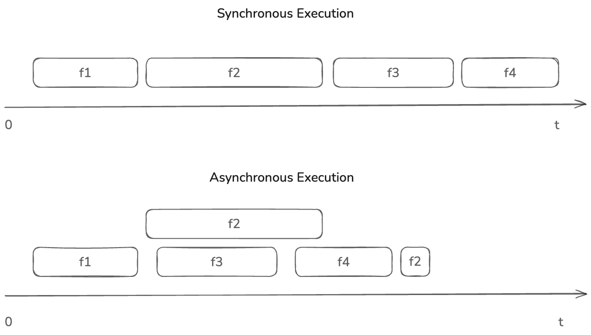

# Asynchronous JavaScript

Javascript is a single-threaded language. This means that it can only execute one task at a time. This is because Javascript runs in a single call stack. This can be a problem when you have to perform tasks that take a long time to complete. For example, if you have to make a network request to fetch data from a third-party server, the browser will have to wait for the request to complete before it can move on to the next line of code. This can make your application unresponsive and slow especially if the third-party API is slow in responding to requests. This reliance on third-party API being highly available and responsive can be a bottleneck in your application.

## What is Asynchronous Programming?

In the previous paragraph, I explained why it can be a bottleneck if your program runs as a single thread process. However, what if you had a mechanism to make a call to the third-party API and then you can move on to the next instruction in your code. When the third-party API responds, you can get back to working with that result. This would be highly efficiently as you're not really waiting for the response from third-party API. The thread is still doing some other computations while third-party API responds. This is exactly how asynchronous programming works.

Asynchronous programming is a way to execute tasks in parallel without blocking the main thread. It is a way to handle tasks that are non-blocking. This means that the main thread can continue executing other tasks while the asynchronous task is being executed in the background. This allows you to perform tasks that take a long time to complete without blocking the main thread.

For example, let's assume our code cosists of four function calls (`f1` to `f4`). In this case, let's assume that the function call `f2` makes a third-party API request. If you execute these functions in synchronous manner, they will execute one after another as shown in below diagram. 

If the same function was called asynchronously, it would simply make a call to the third party API and then continue execution of next function `f3` and `f4` respectively. When the third-party API responds, it would then continue execution of the remaining part of the function `f2` as shown in the above diagram.

## Javascript Event Loop

javascript runs in an environment like a browser or a Node.js environment. These environments provide a runtime environment for javascript to run. The runtime environment provides a call stack, an event loop, and a callback queue. The call stack is where the javascript code is executed. The event loop is responsible for handling asynchronous tasks. Javascript assigns blocking code or events to the environment which invokes the events. Once the event ends, the environment adds a callback function of the event to the callback queue. The callback queue is where the callbacks of asynchronous tasks are stored. The event loop monitors the call stack and callback queues. When the call stack is empty, the event loop moves the callbacks from the callback queue to the call stack. This is how javascript handles asynchronous tasks. It's not that javascript is running in parallel, but it is just a way how it handles asynchronous tasks in a non-blocking way.

The full code execution ends when all events are ended with an empty call stack and an empty callback queue.

This is all well and good, but if the code is being executed in asynchronous manner how do you arrange them to execute in specific order. For example, when you want to show related news feed for the current user, you would want to first retrieve their friends and then retrieve their posts and show them to the user's news feed. If the two functions are being executed in asynchronous manner how do you ensure that the posts are retrieved only after the friends are retrieved. This is where callback functions come in. You will learn about callbacks in the next lesson.