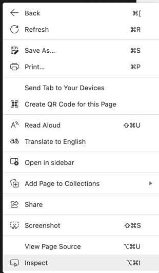
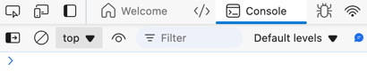
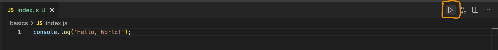

# Intro to Javascript

Javascript is a high-level, interpreted programming language that is widely used for client-side web development. It is a versatile language that can be used for both front-end and back-end development. It is also used for developing mobile applications, games, and server-side applications.

## Features of Javascript

- **Lightweight and Interpreted**: JavaScript is lightweight and interpreted, which means it does not need to be compiled before execution.
- **Object-based**: JavaScript is object-based, which means it treats everything as an object.
- **Versatile**: JavaScript is a versatile language that can be used for both front-end and back-end development. It can also be used for developing mobile apps, desktop apps, games, and server-side applications.
- **Client-side scripting**: JavaScript is mainly used for client-side scripting, which means it runs on the client's browser. This can be used to validate user input, create dynamic content, and interact with the user.
- **Event-driven programming**: JavaScript is an event-driven programming language, which means it responds to events like mouse clicks, key presses, etc. and provides interactivity on the web.
- **Functional programming**: JavaScript supports functional programming paradigms, which means it treats functions as first-class citizens and allows functions to be passed as arguments to other functions.
- **Large Community**: JavaScript has a large community of developers and resources available online, making it easy to find help and support. There are lots of libraries and frameworks available to help you build applications faster and more efficiently.
- **Cross-platform**: JavaScript is a cross-platform language, which means it can run on any platform or device that has a JavaScript engine. This makes it a popular choice for developing web applications that need to run on multiple devices.

## History of Javascript

JavaScript was created by Brendan Eich in 1995 while he was working at Netscape Communications Corporation. It was originally called Mocha and later renamed to LiveScript before finally being named JavaScript. JavaScript was created to add interactivity to web pages and provide a way to validate user input. It quickly became popular due to its ease of use and versatility.

Modern Javascript is based on the ECMAScript standard, which is maintained by the Ecma International standards organization. The latest version of ECMAScript is ES11 (ES2020), which was released in June 2020. The ECMAScript standard is updated regularly to add new features and improve the language. So, it's a living and updating language. ES6 (ES2015) was a major update to the language, introducing new features like arrow functions, classes, and modules.

## How JavaScript Works

In general, Javascript is executed by the browser when a web page is loaded. It can also be executed by a server using Node.js. They are executed by Javascript engines like V8 (used in Chrome), SpiderMonkey (used in Firefox), and Chakra (used in Microsoft Edge). Recent Javascript engines use Just-In-Time (JIT) compilation to optimize the performance of Javascript code.

### What is JIT Compilation?

Just-In-Time (JIT) compilation is a technique used by modern Javascript engines to improve the performance of Javascript code. Instead of interpreting the code line by line, JIT compilers analyze the code and generate machine code that can be executed directly by the CPU. This makes the code run faster and more efficiently. It follows through below steps.

1. **Parsing**: The Javascript engine parses the code and generates an Abstract Syntax Tree (AST).
2. **Compilation**: The engine compiles the AST into bytecode.
3. **Optimization**: The engine optimizes the bytecode using various techniques like inlining, loop unrolling, and dead code elimination.
4. **Execution**: The engine executes the optimized code.

You don't need to know these internal details to write Javascript code, but it's good to have a basic understanding of how Javascript works under the hood.

## Set up and Installation

Javascript does come built into your browser. So, in order to access Javascript you can simply right click on your browser and choose **Inspect**. 



This will open up Developer Tools for the browser. Next, you can find **Console** somewhere in the newly opened window pane. Click on that and that's your Javascript console. 



This is where you can type simple snippets of code and verify how they will work with Javascript language. For example, you can do simple math here just to try out type `1 + 1` and hit Enter. You will see result as `2`.

### Install Node.Js

Another alternative is that you can install Node.js from its [official website](https://nodejs.org/en) for your respective operating system. Once you have downloaded and installed this, you can type command like `node --version` and you will see the Node.js version you've installed.

```shell
$ node --version
v20.16.0
```

### Install VS Code

When you start learning programming, you might need what is known as Integrated Development environment. This is where you will find lots of useful help like auto-suggestion of code, syntax highlighting and better indentation, etc. So, it's highly recommended to use IDE after initial exploration using Javascript console.

You can download VS code for your system from [here](https://code.visualstudio.com/download).

With this, you can simply create a file `index.js` and type your Javascript code in order to execute it. Create a new file `index.js` in your project folder.

```javascript
console.log("Hello, World");
```

Next, to run this code, you will see a run button like this in your VS code. Just click on this and it will run your code.



Alternatively, if you are familiar with Terminal or Command Prompt, you can simply open Terminal and move the location where you've stored your file and use the command `node index.js`.

```shell
$ node index.js
Hello, World!
```