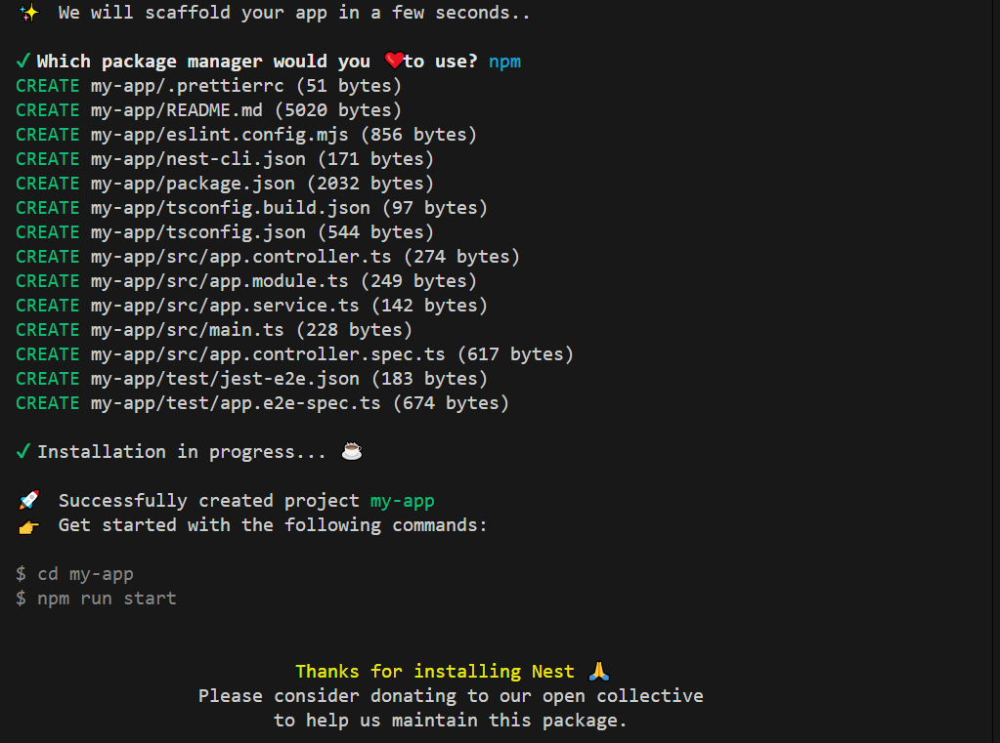

# Create Your First Nest.js Project

NestJS provides a convenient command line tool to help you create a new Nest.js project. This lesson assumes that you've already set up Nest.js command line tool.

## Create Project

From the command line or terminal, navigate to where you want to create your project and run the following command. You can name your project anything you like.

```bash
nest new <app_name>
```

```bash
nest new my-app
```

Once you type this command, the NestJS CLI will prompt you with a series of questions to fill in the details for your new project. You can use arrows to choose your values and press enter to submit them. This will start installation of several packages which will take some time.



## Running Your project

Once the installation is complete, you will see several directories and files under the `my-app` directory. You will learn more about these directories and files in the next lesson. As you can see from high-level overview that this is simply a Node.js project with a package.json file.

Open `package.json` file and you will see several commands already configured to run your project.

For now, simply run below command to start your first NestJS application.

```bash
cd my-app
npm run start:dev
```

This will initialize the application, compiles and starts the application on port 3000 by default. The first time you run this command, it will take some time to start the application, but subsequent runs will be much faster. Open your browser and navigate to `http://localhost:3000` and you should see `Hello World` in the browser.